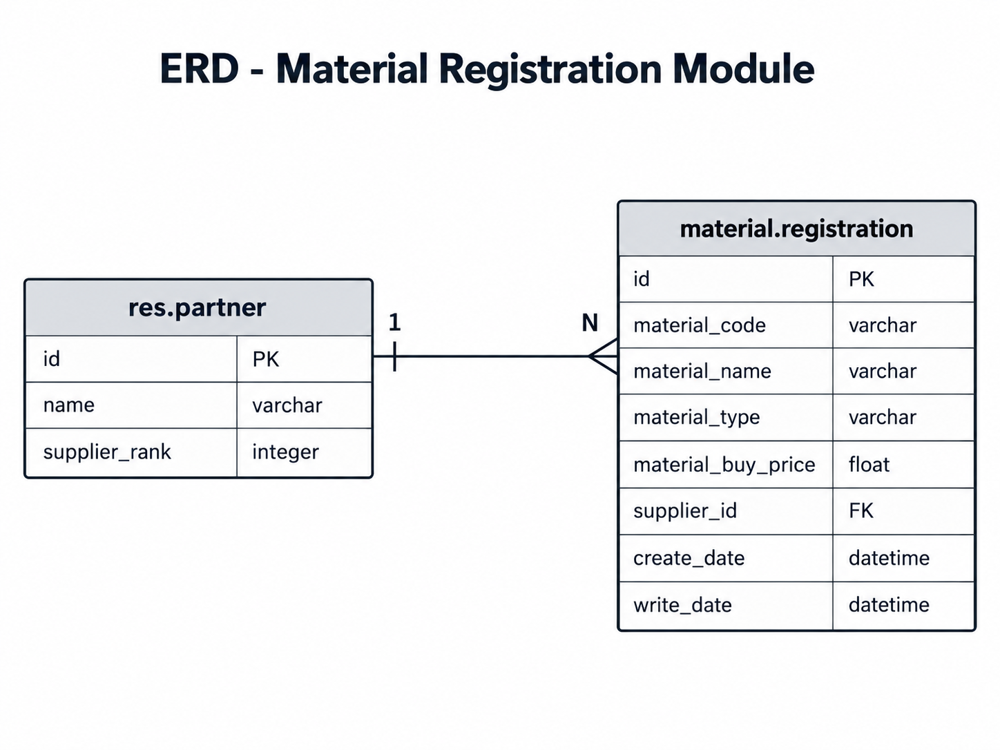

# Material Registration - Odoo 14

Modul ini dibuat untuk kebutuhan technical test backend Odoo 14. Fungsinya adalah mencatat material yang akan dijual, lengkap dengan jenis material, harga beli, dan supplier yang terkait.

Data supplier tidak dibuat sebagai model baru. Modul menggunakan model bawaan Odoo `res.partner`.

## Fitur

Fitur yang tersedia:

- tambah material
- lihat daftar material
- filter material berdasarkan tipe
- lihat detail material
- ubah data material
- hapus material
- validasi harga beli minimal 100
- validasi tipe material
- relasi material dengan supplier
- REST-style API
- unit test untuk model dan controller

Tipe material yang tersedia:

- `fabric`
- `jeans`
- `cotton`

## Struktur Modul

```text
material_registration/
├── controllers/
│   ├── __init__.py
│   └── material_controller.py
├── docs/
│   └── erd.png
├── models/
│   ├── __init__.py
│   └── material.py
├── security/
│   └── ir.model.access.csv
├── tests/
│   ├── __init__.py
│   ├── test_material_controller.py
│   └── test_material_model.py
├── views/
│   └── material_views.xml
├── __init__.py
├── __manifest__.py
└── README.md
```

## Instalasi

Simpan folder `material_registration` di dalam custom addons Odoo.

Contoh:

```text
odoo/
└── custom_addons/
    └── material_registration/
```

Pastikan folder `custom_addons` sudah terdaftar pada `addons_path` di `odoo.conf`.

Contoh:

```ini
addons_path = addons,custom_addons
```

Install modul dengan perintah:

```bash
python odoo-bin -c odoo.conf -d odoo_test -i material_registration --stop-after-init
```

Setelah proses instalasi selesai, jalankan kembali Odoo:

```bash
python odoo-bin -c odoo.conf -d odoo_test
```

Akses Odoo melalui:

```text
http://localhost:8069
```

## Konfigurasi Database

Contoh konfigurasi dasar pada `odoo.conf`:

```ini
[options]

db_host = localhost
db_port = 5432
db_user = odoo14
db_password = your_password

addons_path = addons,custom_addons
```

Password database dan credential lokal sebaiknya tidak ikut dimasukkan ke repository.

## API

Base URL:

```text
http://localhost:8069/api
```

Endpoint yang tersedia:

| Method | Endpoint | Fungsi |
|---|---|---|
| POST | `/api/materials` | Menambah material |
| GET | `/api/materials` | Mengambil semua material |
| GET | `/api/materials?material_type={type}` | Filter berdasarkan tipe |
| GET | `/api/materials/{id}` | Mengambil detail material |
| PUT | `/api/materials/{id}` | Mengubah material |
| DELETE | `/api/materials/{id}` | Menghapus material |

Untuk request `POST` dan `PUT`, body dikirim sebagai raw JSON dengan header:

```text
Content-Type: text/plain
```

Controller membaca raw body tersebut dan mengubahnya menjadi JSON. Response API tetap menggunakan `application/json`.

### Tambah Material

```http
POST /api/materials
```

Body:

```json
{
  "material_code": "MAT-001",
  "material_name": "Cotton Material",
  "material_type": "cotton",
  "material_buy_price": 100,
  "supplier_id": 1
}
```

Contoh response:

```json
{
  "success": true,
  "message": "Material created successfully",
  "data": {
    "id": 1,
    "material_code": "MAT-001",
    "material_name": "Cotton Material",
    "material_type": "cotton",
    "material_buy_price": 100.0,
    "supplier": {
      "id": 1,
      "name": "My Company"
    }
  }
}
```

HTTP status:

```text
201 Created
```

### Ambil Semua Material

```http
GET /api/materials
```

Contoh response:

```json
{
  "success": true,
  "data": [
    {
      "id": 1,
      "material_code": "MAT-001",
      "material_name": "Cotton Material",
      "material_type": "cotton",
      "material_buy_price": 100.0,
      "supplier": {
        "id": 1,
        "name": "My Company"
      }
    }
  ]
}
```

### Filter Material

Contoh filter material dengan tipe `cotton`:

```http
GET /api/materials?material_type=cotton
```

Nilai `material_type` yang diterima:

```text
fabric
jeans
cotton
```

Jika tipe tidak valid, API mengembalikan `400 Bad Request`.

### Detail Material

```http
GET /api/materials/3
```

Jika data ditemukan:

```json
{
  "success": true,
  "data": {
    "id": 3,
    "material_code": "MAT-003",
    "material_name": "Cotton Material",
    "material_type": "cotton",
    "material_buy_price": 100.0,
    "supplier": {
      "id": 1,
      "name": "My Company"
    }
  }
}
```

Jika ID tidak ditemukan:

```json
{
  "success": false,
  "message": "Material not found"
}
```

HTTP status:

```text
404 Not Found
```

### Update Material

```http
PUT /api/materials/3
```

Update dapat dilakukan hanya pada field yang ingin diubah.

Contoh:

```json
{
  "material_name": "Cotton Material Updated",
  "material_buy_price": 150
}
```

Response:

```json
{
  "success": true,
  "message": "Material updated successfully",
  "data": {
    "id": 3,
    "material_code": "MAT-003",
    "material_name": "Cotton Material Updated",
    "material_type": "cotton",
    "material_buy_price": 150.0,
    "supplier": {
      "id": 1,
      "name": "My Company"
    }
  }
}
```

### Hapus Material

```http
DELETE /api/materials/3
```

Response:

```json
{
  "success": true,
  "message": "Material deleted successfully"
}
```

Jika ID yang sama dihapus kembali:

```json
{
  "success": false,
  "message": "Material not found"
}
```

## Validasi

Validasi yang digunakan:

| Field | Aturan |
|---|---|
| `material_code` | wajib diisi |
| `material_name` | wajib diisi |
| `material_type` | wajib diisi |
| `material_type` | hanya menerima `fabric`, `jeans`, atau `cotton` |
| `material_buy_price` | wajib diisi |
| `material_buy_price` | minimal 100 |
| `supplier_id` | wajib diisi |
| `supplier_id` | harus mengarah ke data `res.partner` yang tersedia |

Contoh ketika harga di bawah 100:

```json
{
  "success": false,
  "message": "Validation error",
  "errors": {
    "material_buy_price": "Material buy price must be greater than or equal to 100"
  }
}
```

## ERD

Material memiliki relasi many-to-one dengan supplier. Satu supplier dapat digunakan oleh banyak material, sedangkan satu material hanya memiliki satu supplier.



Model yang digunakan:

```text
res.partner (1) -------- (N) material.registration
```

Field utama `material.registration`:

| Field | Type |
|---|---|
| `id` | Integer |
| `material_code` | Char |
| `material_name` | Char |
| `material_type` | Selection |
| `material_buy_price` | Float |
| `supplier_id` | Many2one (`res.partner`) |
| `create_date` | Datetime |
| `write_date` | Datetime |

## Testing

File unit test berada di:

```text
tests/test_material_model.py
tests/test_material_controller.py

Test dapat dijalankan dengan:

```bash
python odoo-bin -c odoo.conf -d odoo_test -u material_registration --test-enable --stop-after-init
```

Test yang dibuat terdiri dari:

- 8 test untuk model
- 9 test untuk controller/API

Hasil terakhir:

```text
0 failed, 0 error(s) of 17 tests
```

Seluruh 17 test berhasil dijalankan.
